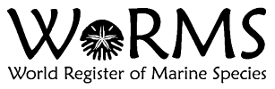

# WoRMS RestAPI Walkthrough
Provided is a general outline of how the WoRMS Rest API can be accessed using R

the Recommended version of r is 3.6+ which can be downloaded from https://www.r-project.org/

```{r}
# Import the required R packages
library(httr)
library(jsonlite)
library(dplyr)
library(tidyr)
```

Initialize the base URL for WoRMS. This variable is unchanged for every api call 
```{r}
WORMS_URL <- "https://www.marinespecies.org/rest"
```


## Getting AphiaIDs
API calls to retrieve aphiaIDs from the WoRMS system. AphiaIDs are the IDs that link to a specific species in the WoRMS database.

## Search for AphiaIDs using vernacular
Basic search using the WoRMS API to get back a AphiaID from a vernacular name

```{r}
# Search WoRMS to get the aphiaID using Atlantic salmon as the vernacular input
vernacular <- 'Atlantic Salmon'

# AphiaRecordsByVernacular
req <- GET(paste0(WORMS_URL,'/AphiaRecordsByVernacular/',URLencode(vernacular)))
fromJSON(content(req, 'text'))
```

### Search using Multilingual vernacular names?
WoRMS accepts vernacular names in a multitude of difference languages as shown below.

```{r}
# Try in French and see if we get the same aphiaID for 'Saumon atlantique'
vernacular <- 'Saumon atlantique'

# AphiaRecordsByVernacular
req <- GET(paste0(WORMS_URL,'/AphiaRecordsByVernacular/',URLencode(vernacular)))

fromJSON(content(req, 'text'))
```

### Searching aphiaID by using scientific name
Use the API call AphiaRecordsByName to retrieve aphiaID WoRMS records using the scientific name
```{r}
# Now let's try the scientific name for Atlantic Salmon, 'Salmo salar'
scientificName <- 'Salmo Salar'

# AphiaRecordsByName
req <- GET(paste0(WORMS_URL,'/AphiaRecordsByName/',URLencode(scientificName)))
fromJSON(content(req, 'text'))
```

### Refine AphiaRecordsByName search

```{r}
# The above cell returned more results than needed. Since we know the exact scientific name
# we are going to add "like=false" to the query,
# this will exclude all the extra like matched results.
scientificName <- 'Salmo Salar'
like_matched <- 'false'  

query = list('like'=like_matched)

# AphiaRecordsByName
req <- GET(paste0(WORMS_URL,'/AphiaRecordsByName/', URLencode(scientificName)), query=query)
fromJSON(content(req, 'text'))
```

### Species Attributes
Using a valid aphiaID, retrieve species specific attribute data held in WoRMs

```{r}
# Now that we got the valid aphiaID for our Atlantic Salmon species, lets use WoRMS to retrieve some species attributes.
salmonID <- 127186 # Atlantic Salmon ID
req <- GET(paste0(WORMS_URL,'/AphiaAttributesByAphiaID/',salmonID))

attributes <- fromJSON(content(req, 'text'))
```
What is returned is a nested dataframe. Using tidyr unnest we can produce a flat table of all of our species attributes.
```{r}

# Running unnest operations for each level of attribute
attributes %>% unnest(children, names_repair='unique', keep_empty =TRUE) %>% 
  unnest(children, names_repair='unique', keep_empty =TRUE)%>% 
  unnest(children, names_repair='unique', keep_empty =TRUE)%>% 
  unnest(children, names_repair='unique', keep_empty =TRUE) -> attributes_unnested

attributes_unnested
```
Get more info about measurementTypes accepted for a CategoryID
The call to AphiaAttributeValuesByCategoryID will show all available acceptable values for a given CategoryID

ID Values
0 = All Attribute Measurement Types
1 = IUCN Red List Category
2 = Geologic time periods

```{r}
# Using measurementTypeID = 1 (IUCN Red List Category) 
# We will show all the accepted values for this category
CategoryID = 0

# AphiaAttributeValuesByCategoryID
req <- GET(paste0(WORMS_URL,'/AphiaAttributeValuesByCategoryID/',CategoryID))
fromJSON(content(req, 'text'))
```

### Distributions
Querying for distributions using AphiaDistributionsByAphiaID will return regions where a species has been observed including marineregions.org links.

```{r}
# Lets retrieve the list of distributions on record for Atlantic Salmon, with record status and quality status
salmonID <- 127186 # Atlantic Salmon ID
req = GET(paste0(WORMS_URL, '/AphiaDistributionsByAphiaID/', salmonID))
distributions <- fromJSON(content(req, 'text'))
distributions
```

### External Identifiers
Many other Taxonomic databases use their own ID systems to reference species records. Using AphiaExternalIDByAphiaID for a given aphiaID, you can retrieve these external IDs as they are known to WoRMS.


```{r}
salmonID = 127186
  
# Let's get all the external IDs for Atlantic Salmon from external taxonomic systems known to WoRMS
external_ids <- list('algaebase' = 'Algaebase species ID',
    'bold' = 'Barcode of Life Database (BOLD) TaxID',
    'dyntaxa' = 'Dyntaxa ID',
    'eol' = 'Encyclopedia of Life (EoL) page identifier',
    'fishbase' = 'FishBase species ID',
    'iucn' = 'IUCN Red List Identifier',
    'lsid' = 'Life Science Identifier',
    'ncbi' = 'NCBI Taxonomy ID (Genbank)',
    'tsn' = 'ITIS Taxonomic Serial Number',
    'gisd' = 'Global Invasive Species Database')

# Loop and print out all known IDs
for (ext in names(external_ids)){
  # AphiaExternalIDByAphiaID
  req <- GET(paste0(WORMS_URL,'/AphiaExternalIDByAphiaID/',salmonID,'?type=',ext))
  if (length(req$content) == 0){
    print(paste(external_ids[[ext]],':Not found'))
  }else{
    print(paste(external_ids[[ext]],':', fromJSON(content(req, 'text',  encoding = "UTF-8"))))
  }
  
}
```

## Sources
Get source and reference data given a valid aphiaID value.

```{r}
# Now we are going to retrieve all the source reference data Atlantic Salmon
req <- GET(paste0(WORMS_URL,'/AphiaSourcesByAphiaID/',salmonID))
fromJSON(content(req, 'text'))
```

### Taxonomic data
Directly query taxonomic data. Source/definitions borrowed from http://www.marinespecies.org/rest/
```{r}
# AphiaChildrenByAphiaID
req <- GET(paste0(WORMS_URL,'/AphiaChildrenByAphiaID/',salmonID))
fromJSON(content(req, 'text'))
```

```{r}
# the complete classification for one taxon. This also includes any sub or super ranks.

# AphiaClassificationByAphiaID
req <- GET(paste0(WORMS_URL,'/AphiaClassificationByAphiaID/',salmonID))
fromJSON(content(req, 'text'))
```

```{r}
# the AphiaID for a given name
scientific_name = 'Salmo salar'

# AphiaIDByName
req <- GET(paste0(WORMS_URL,'/AphiaIDByName/',URLencode(scientific_name)))
fromJSON(content(req, 'text'))
```

```{r}
# the name for a given AphiaID
# AphiaNameByAphiaID

req <- GET(paste0(WORMS_URL,'/AphiaNameByAphiaID/',salmonID))
fromJSON(content(req, 'text'))
```

```{r}
# the complete AphiaRecord for a given AphiaID

# AphiaRecordByAphiaID
req <- GET(paste0(WORMS_URL,'/AphiaRecordByAphiaID/',salmonID))
fromJSON(content(req, 'text'))
```

```{r}
# an AphiaRecord for multiple AphiaIDs in one go (max: 50)
aphiaID1 <- 127186 # Atlantic Salmon
aphiaID2 <- 137116 # Narwhal
# AphiaRecordsByAphiaIDs
req <- GET(paste0(WORMS_URL,'/AphiaRecordsByAphiaIDs?aphiaids[]=',aphiaID1,'&aphiaids[]=',aphiaID2))
fromJSON(content(req, 'text'))
```

```{r}
# Lists all AphiaRecords (taxa) that have their last edit action (modified or added) during the specified period
startdate <- '1998-10-01'
enddate <- '1999-12-31'

# AphiaRecordsByDate
req <- GET(paste0(WORMS_URL,'/AphiaRecordsByDate?startdate=',startdate,'&enddate=',enddate))
fromJSON(content(req, 'text'))
```

```{r}
# Try to find AphiaRecords using the TAXAMATCH fuzzy matching algorithm by Tony Rees http://www.cmar.csiro.au/datacentre/taxamatch.htm
fuzzy_scientific_name = 'Salmon salarr'
# AphiaRecordsByMatchNames
req <- GET(paste0(WORMS_URL,'/AphiaRecordsByMatchNames?scientificnames[]=',URLencode(fuzzy_scientific_name)))
fromJSON(content(req, 'text'))
```


```{r}
# For each given scientific name, try to find one or more AphiaRecords
scientific_name1 = 'Salmo salar'
scientific_name2 =  'Monodon monoceros'

# AphiaRecordsByNames
req <- GET(paste0(WORMS_URL,'/AphiaRecordsByNames?scientificnames[]=', URLencode(scientific_name1),
                  '&scientificnames[]=', URLencode(scientific_name2)))
fromJSON(content(req, 'text'))
```

```{r}
# the AphiaRecords for a given taxonRankID (max 50)
rankID <- '220' # Species

# AphiaRecordsByTaxonRankID
req <- GET(paste0(WORMS_URL,'/AphiaRecordsByTaxonRankID/',rankID))
fromJSON(content(req, 'text'))
```

```{r}
# all synonyms for a given AphiaID
# AphiaSynonymsByAphiaID
req <- GET(paste0(WORMS_URL,'/AphiaSynonymsByAphiaID/',salmonID))
fromJSON(content(req, 'text'))
```

```{r}
# taxonomic ranks by their identifier
rankID = '220' # Species
# AphiaTaxonRanksByID
req <- GET(paste0(WORMS_URL,'/AphiaTaxonRanksByID/',rankID))
fromJSON(content(req, 'text'))
```

```{r}
# taxonomic ranks by their name
# AphiaTaxonRanksByName
req <- GET(paste0(WORMS_URL,'/AphiaTaxonRanksByName/',salmonID))
fromJSON(content(req, 'text'))
```